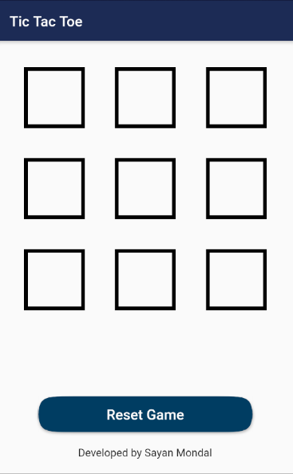
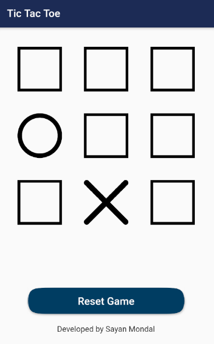

# Tic Tac Toe
[](https://GitHub.com/Naereen/StrapDown.js/graphs/commit-activity) [](https://GitHub.com/Naereen/ama) [](https://code.visualstudio.com/)
[](https://github.com/S-ayanide/Flutter-TicTacToe/network) [](https://github.com/S-ayanide/Flutter-TicTacToe/stargazers) [](https://github.com/ellerbrock/open-source-badges/)
[](https://github.com/S-ayanide/Flutter-TicTacToe/blob/master/LICENSE)

A Tic Tac Toe Flutter game which auto resets after you win, it also has a reset everything feature. ⭕️ ✖️
### 👉 If you like this repo then please give it a ⭐️

## Short Description
This Flutter game is a very famous yet easy start for beginners. Its a Tic Tac Toe game which is built using one Stateless and a Stateful widget, You can change the assets if you wish too, everything is properly documented including the game logic and the state changes, It has a delay feature which auto resets the game after a winner is declared, you can also manually reset the game if you want to.

## Screenshots
    
     
## NOTE:
This project is subject to change by the developer and is still in development

## How to run this
Running this is as simple as it gets. Follow this steps
1. Open your terminal (NOTE: git bash prefered/ Terminal on VS Code)
2. Navigate to the project folder where you have cloned this repo.
3. Open an emulator or plug in a real device
4. Type the following command in the terminal 
     ```
     flutter run
     ```
     
## Pull Request

Pull Requests are welcome. Please follow these rules for the ease of understanding:
* Make sure to check for available issues before raising one
* Give me a maximum of 24-48 hours to respond
* Have proper documentation on the parts you are changing/adding


